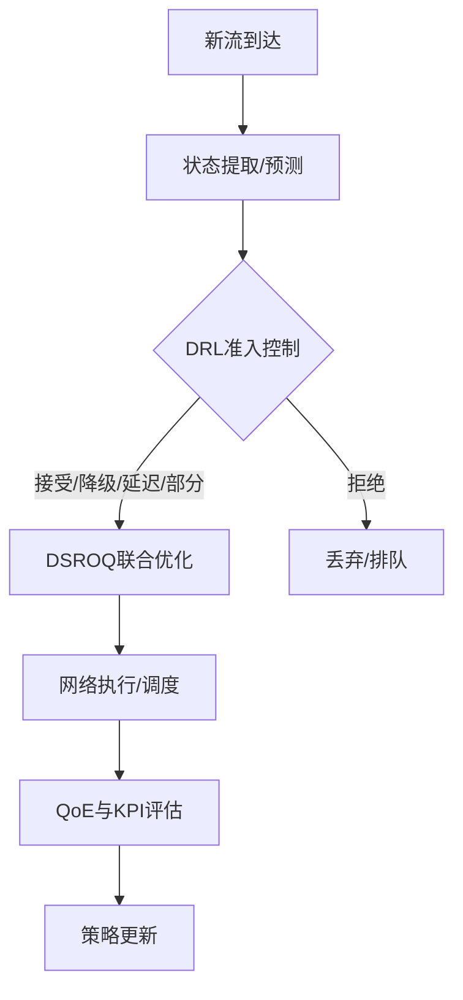

# 第3章 系统总体设计

## 3.1 问题建模与分析

- 决策时刻：新流到达事件驱动；时间步与窗口协同。
- MDP抽象：状态S（时间感知+网络与QoE特征）、动作A（接纳/拒绝/降级/延迟/部分）、奖励R（QoE变化+公平与违规惩罚+效率奖励），折扣γ。
- 目标：最大化长期加权QoE，满足关键QoS约束并兼顾公平性。

## 3.2 分层决策架构设计

上层DRL准入控制为“是否/如何接纳”做出策略性决策，下层DSROQ执行联合路由、带宽分配与调度，实现资源层面的最优化与时序同步。

## 3.3 系统功能模块

- 状态/动作/奖励子系统；预测与趋势提取。
- DSROQ接口：MCTS路由、李雅普诺夫调度、资源重分配触发。
- 仿真环境：Hypatia（satgenpy/ns3-sat-sim）封装与统一API。
- 可视化与监控：Cesium 3D、指标看板、日志与追踪。

## 3.4 技术路线选择

- 后端：Python + Hypatia + PyTorch + Stable-Baselines3 + SimPy
- 前端：Vue.js + CesiumJS + ECharts
- API：Flask（REST）
- 部署：Docker/K8s；监控：Prometheus/Grafana；追踪：MLflow

## 3.5 本章小结

阐明了以DRL为上层、以DSROQ为下层的分层协同框架，并明确了工程与实验的支撑技术路线。

---

## 附：图表清单（建议）
- 分层决策总体架构图（Mermaid/TikZ）
- 数据流与接口时序图（准入→分配→执行→评估→学习）
- 状态/动作/奖励设计示意图

## 附：关键公式（MDP/目标）
- MDP五元组：\( \mathcal{M}=(\mathcal{S},\mathcal{A},P,R,\gamma) \)
- 折扣回报目标：
\[ \max_{\pi} \; \mathbb{E}_{\pi} \Big[ \sum_{t=0}^{\infty} \gamma^{t} r_t \Big] \]
- 奖励一般形态（详见第4章）：
\[ r_t = w_1\,\Delta\mathrm{QoE}_t + w_2\,\mathrm{Fair}_t + w_3\,\mathrm{Eff}_t - w_4\,\mathrm{Viol}_t - w_5\,\mathrm{DelayPen}_t \]
- 约束与拉格朗日松弛：
\[ \min_{\lambda \ge 0}\; \max_{\pi}\; \mathbb{E}\big[\sum_t \gamma^t (r_t - \sum_k \lambda_k g_k(s_t,a_t))\big] \]

---

## 参考公式对齐
详见 `docs/reference/formula_alignment.md`。

## 附：定位协同与特征注入（新增）
- 状态特征：CRLB/GDOP、可见波束数、协作卫星数、平均/最小SINR、波束调度提示（Beam Hint）。
- 接口对接：`Hypatia→Positioning` 模块产出定位质量向量，经 `State Extractor` 归一化后拼接进DRL状态；同时在 `Evaluation` 汇总“定位可用性”等指标。
- 协同策略：在资源紧张时优先保证高定位需求业务的可用性；当定位质量退化时，触发保守接纳或延迟接纳策略，与DSROQ重分配联动。
