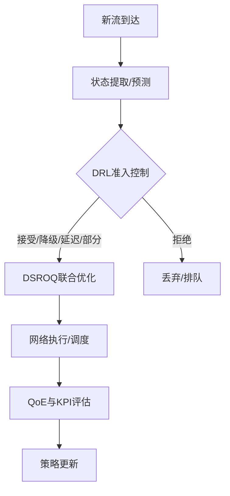

# 第3章 系统总体设计

## 3.1 问题建模与分析

- 决策时刻：新流到达事件驱动；时间步与窗口协同。
- MDP抽象：状态S（时间感知+网络与QoE特征）、动作A（接纳/拒绝/降级/延迟/部分）、奖励R（QoE变化+公平与违规惩罚+效率奖励），折扣γ。
- 目标：最大化长期加权QoE，满足关键QoS约束并兼顾公平性。

## 3.2 分层决策架构设计

上层DRL准入控制为“是否/如何接纳”做出策略性决策，下层DSROQ执行联合路由、带宽分配与调度，实现资源层面的最优化与时序同步。



### 3.2.1 模块边界与接口（新增）

- 准入模块（Admission）：
  - 输入：新流到达事件、网络/定位状态特征（含CRLB/GDOP、可见波束/协作卫星、Beam Hint）、历史与趋势。
  - 输出：已接纳业务集合、优先级/权重画像、降级/延迟/部分接纳策略、队列约束提示。
- 调度模块（Scheduling/DSROQ）：
  - 输入：准入输出的业务集合与策略约束、网络瞬时/预测状态、链路/队列信息。
  - 输出：多跳路由、带宽分配、调度次序与速率控制、队列权重更新；必要时触发重分配。
- 协同关系：接口基于“集合+约束+画像”三要素解耦耦合关系，支持在不改动对方内部算法的前提下独立迭代与替换。

### 3.2.2 协同策略与失效保护（新增）

- 当定位质量退化或拥塞风险上升时，准入进入保守模式（优先级降低、延迟或部分接纳），调度触发李雅普诺夫稳定性保护的带宽回收与路径切换。
- 当业务结构变化（EF/AF/BE占比波动）时，准入动态调整权重画像，调度依据新画像重排队列与重分配带宽。
- 失效保护：任一模块异常时，降级到阈值准入 + 启发式调度的安全基线，保证可用性。

## 3.3 系统功能模块

- 状态/动作/奖励子系统；预测与趋势提取。
- DSROQ接口：MCTS路由、李雅普诺夫调度、资源重分配触发。
- 仿真环境：Hypatia（satgenpy/ns3-sat-sim）封装与统一API。
- 可视化与监控：Cesium 3D、指标看板、日志与追踪。

## 3.3.1 接触计划与时间扩展图建模（新增）

- 接触计划（Visibility/Contact Plan）：由 `Hypatia` 产生卫星-地面/卫星-卫星的可见性窗口、仰角、Doppler与带宽上限，供状态提取与路由代价计算使用。
- 时间扩展图（Time-Expanded Graph, TEG）：以时间步Δτ离散化网络，节点复制为 \( V_t \)，边带时间依赖代价 \( c_t(e) \) 与可用性指示 \( a_t(e)\in\{0,1\} \)。
- seam与重路由惩罚：跨缝边附加代价 \( \kappa_{seam} \)；路径变更惩罚/冷却 \( \kappa_{chg},\ T_{cool} \) 以限制重路由频率，提升路由寿命与稳定性。
- 模块落点：TEG构造在 `src/hypatia/network_state.py`；代价与惩罚在 `src/dsroq/mcts_routing.py` 与 `src/dsroq/core.py` 中实现，可配置注入到李雅普诺夫优化的权重项。

## 3.4 技术路线选择

- 后端：Python + Hypatia + PyTorch + Stable-Baselines3 + SimPy
- 前端：Vue.js + CesiumJS + ECharts
- API：Flask（REST）
- 部署：Docker/K8s；监控：Prometheus/Grafana；追踪：MLflow

## 3.5 本章小结

阐明了以DRL为上层、以DSROQ为下层的分层协同框架，并明确了工程与实验的支撑技术路线。

---

## 附：图表清单（建议）
- 分层决策总体架构图（Mermaid/TikZ）
- 数据流与接口时序图（准入→分配→执行→评估→学习）
- 状态/动作/奖励设计示意图

## 附：关键公式（MDP/目标）
- MDP五元组：$\mathcal{M}=(\mathcal{S},\mathcal{A},P,R,\gamma)$
- 折扣回报目标：
\[ \max_{\pi} \; \mathbb{E}_{\pi} \Big[ \sum_{t=0}^{\infty} \gamma^{t} r_t \Big] \]
- 奖励一般形态（详见第4章）：
\[ r_t = w_1\,\Delta\mathrm{QoE}_t + w_2\,\mathrm{Fair}_t + w_3\,\mathrm{Eff}_t - w_4\,\mathrm{Viol}_t - w_5\,\mathrm{DelayPen}_t \]
- 约束与拉格朗日松弛：
\[ \min_{\lambda \ge 0}\; \max_{\pi}\; \mathbb{E}\big[\sum_t \gamma^t (r_t - \sum_k \lambda_k g_k(s_t,a_t))\big] \]

---

## 参考公式对齐
详见 `docs/reference/formula_alignment.md`。

## 附：定位协同与特征注入（新增）
- 状态特征：CRLB/GDOP、可见波束数、协作卫星数、平均/最小SINR、波束调度提示（Beam Hint）。
- 接口对接：`Hypatia→Positioning` 模块产出定位质量向量，经 `State Extractor` 归一化后拼接进DRL状态；同时在 `Evaluation` 汇总“定位可用性”等指标。
- 协同策略：在资源紧张时优先保证高定位需求业务的可用性；当定位质量退化时，触发保守接纳或延迟接纳策略，与DSROQ重分配联动。

### 3.2.3 接口契约总览（新增）

- 核心思想：上层准入向下层DSROQ输出“集合+画像+约束”三要素；定位模块提供`Apos/CRLB/GDOP/Beam Hint`等服务性信号。

接口示例（Admission → DSROQ）：
```json
{
  "flows": [
    {
      "id": "u1",
      "class": "EF",
      "demand_mbps": 5.0,
      "latency_ms": 50,
      "duration_s": 120,
      "position": {"lat": 39.9, "lon": 116.4}
    }
  ],
  "profiles": {
    "weights": {"EF": 1.2, "AF": 1.0, "BE": 0.7},
    "lambda_pos": 0.2
  },
  "constraints": {
    "seam_penalty": 0.5,
    "reroute_cooldown_ms": 5000,
    "min_visible_beams": 2,
    "min_coop_sats": 2,
    "crlb_threshold": 50,
    "beam_hint": [
      {"user_id": "u1", "candidates": ["b12", "b45"]}
    ]
  }
}
```

与Web端点的对齐（文档级映射）：
- 准入：`POST /api/admission/request`（提交`flows/profiles/constraints`）。
- 定位指标：`GET /api/positioning/metrics`（查询`Apos/CRLB/GDOP`聚合）。
- 波束提示：`POST /api/positioning/beam_hint`（获取每用户的候选波束集合）。
- 网络视图：`GET /api/network/topology`（供TEG/可视性可视化）。

补充说明：`/api/positioning/metrics` 同时支持 `POST` 以 JSON 体提交复杂查询（与本节字段命名严格一致）。

## 3.6 实现落点索引表（新增）

| 模块 | 文档关键点 | 实现落点 | 相关Web端点 |
| --- | --- | --- | --- |
| Hypatia/网络状态 | 接触计划、TEG节点/边 | `src/hypatia/network_state.py` | `GET /api/network/topology` |
| DSROQ-路由 | 跨缝惩罚、路径代价 | `src/dsroq/mcts_routing.py` |（内部计算）|
| DSROQ-调度 | 李雅普诺夫与重分配 | `src/dsroq/core.py` | `POST /api/simulation/start`（触发流程）|
| 准入控制 | DRL/PPO环境与策略 | `src/admission/*` | `POST /api/admission/request` |
| 定位协同 | Apos/CRLB/GDOP/Beam Hint | `src/positioning/` | `GET /api/positioning/metrics`, `POST /api/positioning/beam_hint` |

说明：以上为文档级索引与“文件名导航”，帮助读者从设计跳转到实现与端点；不约束内部具体实现细节，具体以仓库实际实现为准。

### 工程端点补充（选读）

- `GET /api/network/state`：工程态的聚合状态视图（便于调试与展示）。
- `GET /api/statistics`：工程态的统计聚合端点（可选实现）。
- `GET /api/scenarios/*`：场景列表与详情（便于前端交互）。
